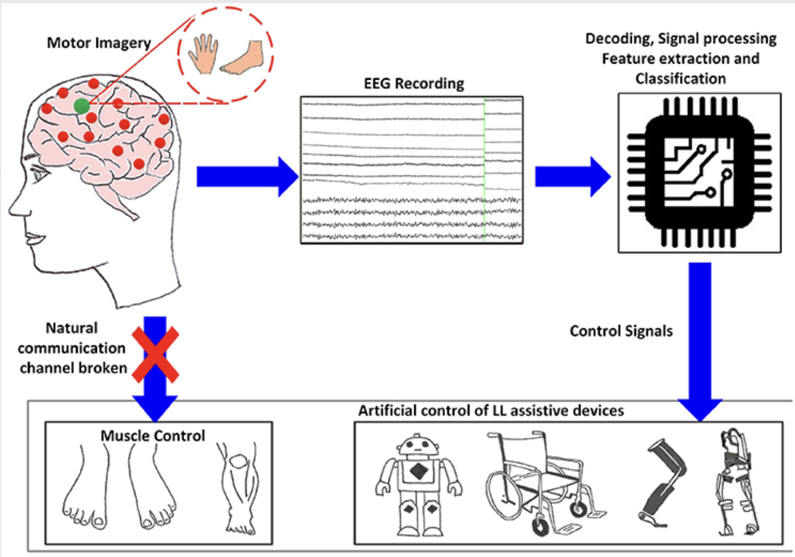

___
# CLASSIFICATION OF SINGLE-JOINT MOTOR IMAGERY EEG-BASED TASKS FOR BCI APPLICATIONS
___

## Introduction

Brain Computer Interfaces(BCIs) have emerged as a transformative technology, enabling communication between the brain and external computing devices. Through the translation of brain activity to control signals, BCIs offer significant potential in domains across neurorehabilitation, assistive devices and human-computer interactions. Among the various BCI paradigms, Motor Imagery (MI)-based BCIs leverage electroencephalography (EEG) signals to detect imagined movements, eliminating the requirement for physical motion. 

The accurate classification of MI EEG signals continues to be a crucial challenge in BCI research, as it directly influences the system’s responsiveness and usability. Traditional MI classification research so far focuses on distinguishing between broad movement categories, such as left-hand and right-hand imagery. However, recent studies suggest that targeting single-joint movements (e.g., wrist, knee, elbow) might lead to more precise and natural control mechanisms.

Accordingly, this study focuses on a single-joint, specifically the wrist, based MI task classification. The introduction of a novel model capable of distinguishing distinct wrist movements and investigating model performance across distinct joint movements, is the main aim of this study. Thus, contributing to improved precision in BCI applications.

## Problem Statement

Classifying EEG signals for single-joint movements (wrist pronation / supination) is challenging due to low signal-to-noise ratios and overlapping spatial features. Existing MI-based BCI systems primarily focus on broad limb movements, limiting precision and hindering the development of applications requiring fine motor control, such as prosthetics and neurorehabilitation.

## Objectives

- Develop a robust classification model for wrist pronation/supination MI tasks using EEG data.
- Evaluate different preprocessing, feature extraction and machine learning approaches.
- Address inter-subject variability in single-joint MI-based EEG classification.

## Proposed Methodology

The primary objective is to classify MI tasks for single joint movements, focusing on the wrist, with high accuracy to enhance the usability of Brain-Computer Interface(BCI) applications in neurorehabilitation and assistive technology. 

The higher overview of steps involved in classifying MI tasks is shown below. 

![Proposed Approach]

### EEG Data
EEG signals of 25 healthy subjects performing wrist movements, pronation and supination, are obtained through the publicly available dataset on GigaDB(https://gigadb.org/dataset/100788). 

